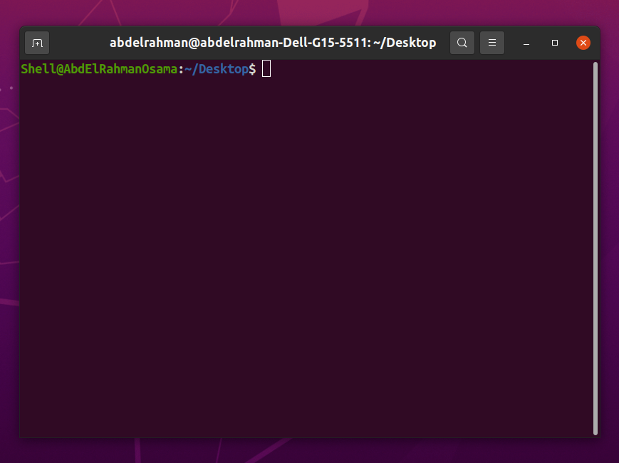
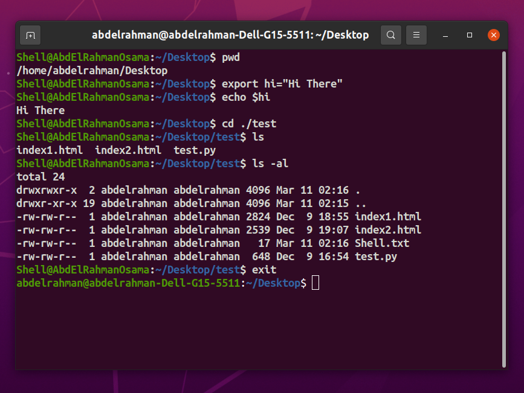

# Simple Shell (Multi-Processing)

 

[](https://opensource.org/licenses/MIT) [](https://en.wikipedia.org/wiki/C_(programming_language))

## Overview

This is a simple Unix shell program implemented in C, supporting multi-processing. The shell allows users to execute commands, both built-in and external, and provides features such as environment variable handling, background process execution, and logging of child process terminations.

## Features

- Execute internal shell commands such as `cd`, `echo`, and `export`.
- Execute external commands with or without arguments.
- Support background execution of commands using the `&` symbol.
- Handle environment variables and evaluate expressions.
- Log child process terminations to a file.
- Exit the shell gracefully using the `exit` command.

## Usage

To compile and run the shell program, use the following commands:

```bash
gcc Shell.c -o Shell.o && ./Shell.o
```
Once the shell is running, you can enter commands just like in a regular Unix shell. You can use built-in commands (`cd`, `echo`, `export`) or external commands (e.g., `ls`, `mkdir`, `firefox`). To exit the shell, simply type `exit`.

Implementation Details
----------------------

*   The shell parses user input, evaluates expressions, and executes commands accordingly.
*   Built-in commands are handled internally within the shell.
*   External commands are executed as separate processes using `fork()` and `execvp()`.
*   Background processes are supported by appending `&` to the command.
*   Child process terminations are logged using a signal handler for `SIGCHLD`.
*   Environment variables are stored and evaluated during command execution.

License
-------

This project is licensed under the MIT License. See the [LICENSE](LICENSE) file for details.

